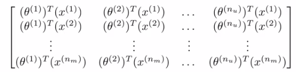

#########################################
Weekly Share
#########################################
:Auther: Xuemei Wang
:Date: 2018-11-05

.. contents:: :depth: 1

Latent factor model
#########################################
Why latent factor model
=========================================
1. user-vectors or item-vectors are not orthogonal (itemCF & userCF)
2. it is hard to extract (real accurate orthogonal) features (content-based)
 
Example from movie
=========================================

This example from `Standord Machine Learning`_

.. _`Standord Machine Learning`: https://www.coursera.org/learn/machine-learning/home/week/9

.. figure:: images/simple.png

* To introduct notation:

  * :math:`n_u` - Number of users
  * :math:`n_m` - Number of movies
  * :math:`r(ij)` 1 if user j has rated movie i, else 0
  * :math:`y^{(i, j)}` rating given by user j to movie i (defined only if :math:`r(i, j) = 1` )

* so for this example

  * :math:`n_u = 4`
  * :math:`n_m = 5`
  * Summary of scoring

    * Alice and Bob gave good ratings to romantic movies, but low scores to action films
    * Carol and Dave gave good ratings for action films but low ratings to romantics

  * The problem is as follows:

    * Give :math:`r(i, j)` and :math:`y^{(i, j)}` go through and try and predict missing values (?s)

Content based recommendation
=========================================

.. figure:: images/content.png

* notation

  * For each movie we have a feature which measure degree to which each film is a

    * Romance ( :math:`x_1` )
    * Action ( :math:`x_2` )
    * Add an extra feature which is :math:`x_0 = 1` for each film :math:`x^{(i)} = \left[\begin{array}{c}1\\0.9\\0\end{array}\right]`
    * for our dataset we have :math:`\{x^{(1)}, x^{(2)}, x^{(3)}, x^{(4)}, x^{(5)}\}`
      
      * where each of these is [3x1] vector with an :math:`x_0 = 1` and then a romance and an action score

  * We would treat each rating for each user as a seperate linear regression problem

    * For each user j we would learn a parameter vector :math:`\theta^{(j)}`
    * Then predict that user j will rate movive with :math:`\theta^{(j)T}x^{(i)} = \hat{y}^{(ij)}`

  * Lets take user 1 (Alice) and see what she makes of the Cute Puppies of Love

    * We have parameter vector :math:`\theta` associated with Alice. Assume that we hve learn (we will explain how later) that :math:`\theta^{(1)} = \left[\begin{array}{c}0\\5\\0\end{array}\right]`
    * Our prediction will be equal to :math:`\theta^{(1)T}x^{(3)} = 0\times 1 + 5 \times 0.99 + 0 \times 0 = 4.95` which seems a reasonable value

How do we learn :math:`\theta^{(j)}`
=========================================

For user j, optimize the regularized cost fuction related to user j:

.. math::

  \min_{\theta{(j)}} \frac{1}{2}\sum_{i:r(i, j) = 1} (\theta^{(j)T}x^{(i)} - y^{(i, j)})^2 
  + \frac{\lambda}{2}\sum_{k = 1}^n(\theta^{(j)}_k)^2

For our recommender system we want to learn parameters for all users. (:math:`\lambda` is calculated from validation set.)

.. math::

  \min_{{\{\theta^{(j)}}\}_j} \frac{1}{2}\sum_{j = 1}^{n_u}\sum_{i:r(i, j) = 1} (\theta^{(j)T}x^{(i)} - y^{(i, j)})^2 
  + \frac{\lambda}{2}\sum_{j = 1}^{n_u}\sum_{k = 1}^n(\theta^{(j)}_k)^2

Using gradient descent algorithm

.. math::

  \theta_k^{(j)} := \theta_k^{(j)} - \alpha \Big[\sum_{i:r(i, j) = 1} (\theta^{(j)T}x^{(i)} - y^{(i, j)})x_k^{(i)} + \lambda(1-\delta_{k0})\theta_k^{(j)}\Big]

Collaborative filtering Algorithm
=========================================

.. figure:: images/collaborative.png

Cost funtion

.. math::

  J(x^{(1)}, ..., x^{(n_m)},  \theta^{(1)}, ..., \theta^{(n_u)}) =
  \frac{1}{2}\sum_{(i, i):r(i, j) = 1}
  (\theta^{(j)T}x^{(i)} - y^{(i, j)})^2 
  + \frac{\lambda}{2}\sum_{i = 1}^{n_m}\sum_{k = 1}^n(x^{(i)}_k)^2
  + \frac{\lambda}{2}\sum_{j = 1}^{n_u}\sum_{k = 1}^n(\theta^{(j)}_k)^2

.. math::

  \min_{{\{\theta^{(j)}}\}_j{\{x^{(i)}}\}_i}

Both :math:`\Theta` and :math:`X` are unknown

.. math::

  \begin{eqnarray}
  x_k^{(i)} &:=& x_k^{(i)} - \alpha\Big[\sum_{j:r(i, j) = 1}(\theta^{(j)T}x^{(i)} - y^{(i, j)})\theta_k^{(j)} + \lambda x_k^{(i)}\Big]\\
  \theta_k^{(j)} &:=& \theta_k^{(j)} - \alpha\Big[\sum_{j:r(i, j) = 1}(\theta^{(j)T}x^{(i)} - y^{(i, j)})x_k^{(i)} + \lambda \theta_k^{(j)}\Big]\\
  \end{eqnarray}

Initialize them by small random values.

Vectorization
=========================================

ranking matrix Y

.. figure:: images/ranking.png

predicted ratings

notation

.. math::
  X = \left[\begin{array}{c}
  \textemdash (x^{(1)})^T\textemdash \\
  \textemdash (x^{(2)})^T\textemdash \\
  ...\\
  \textemdash (x^{(n_m)})^T\textemdash 
  \end{array}
  \right]

.. math::

  \Theta = \left[\begin{array}{c}
  \textemdash (\theta^{(1)})^T\textemdash \\
  \textemdash (\theta^{(2)})^T\textemdash \\
  ...\\
  \textemdash (\theta^{(n_u)})^T\textemdash 
  \end{array}
  \right]

.. math::

  R = \left[\begin{array}{cccc}1&1&1&1\\1&0&0&1\\0&1&1&0\\1&1&1&1\\1&1&1&1\end{array}\right]

.. math::

  \begin{eqnarray}
  X &=& (1 - \alpha\lambda)X - \alpha ((X \Theta^T - Y) \cdot R)\Theta \\
  \Theta &=& (1 -\alpha\lambda)\Theta - \alpha ((X \Theta^T - Y) \cdot R)^T X
  \end{eqnarray}

Mean Normalization
=========================================

Blah blah ...

One-Class Collaborative Filtering
=========================================

* Problem: Negative examples and unlabeled positive examples are mixed together and we are typically unable to distinguish them.
* Strategies:

  * balance the numbers of positive and negative samples
  * negative samples: items which are popular but the user hasn't acted with

Parameters
=========================================

1. dimensions of the latent vectors :math:`F`;
2. learning rate :math:`\alpha`;
3. regularization parameter :math:`\lambda`
4. ration between negative and positive samples :math:`ratio`

Some metric
=========================================

1. mean item popularity :math:`\bar{\log(1 + n_p)}`

Add Content-based features for real time
=========================================

For real time (online) add content-based features

Comparisons
=========================================

Blah blah ...

Graph-Based Model
#########################################

In the mathematical field of graph theory, a bipartite graph (or bigraph) is a graph whose vertices can be devided into two disjoint and indenpend sets :math:`U` and V such that every edge connects a vertex in and one in V. 

Relatiton between [item|user]CF and Grahp-Based model

Coherence of two vertices:

1. numbers of paths
2. length of pathes
3. properties(popularity) of vertices on pahts

Topic-Sensitive PageRank
=========================================

.. math::

  PR(v) = \left
  \begin{cases}
  \alpha\sum_{v'\in in(v)} \frac{PR(v')}{\mid out(v')\mid} & (v \neq v_u)\\
  (1 -\alpha) + \alpha \sum_{v' \in in(v)}\frac{PR(v')}{\mid out(v')\mid} & (v = v_u)
  \end{cases}

1. :math:`\alpha` chance/probobality to move on, :math:`(1 - \alpha)` to stay
2. directed graph
3. not a bipartite graph
